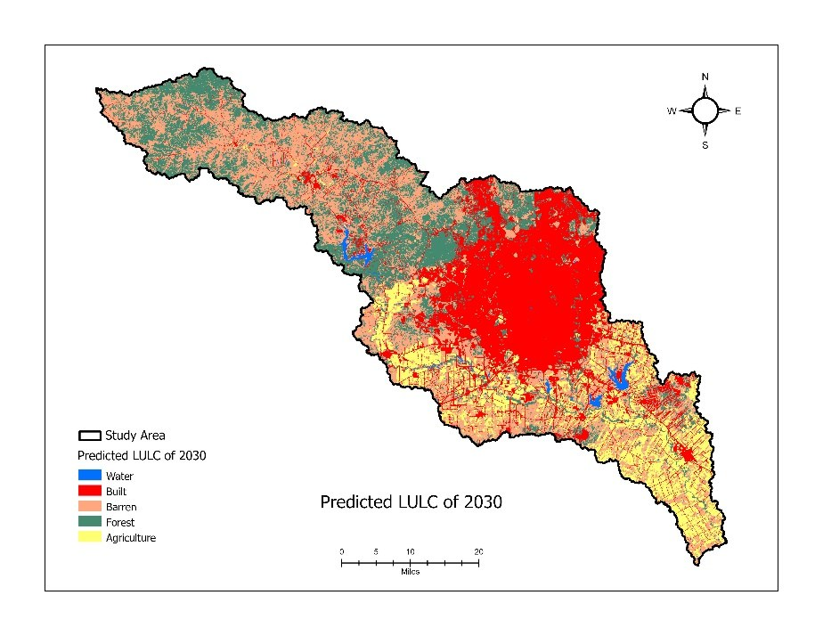
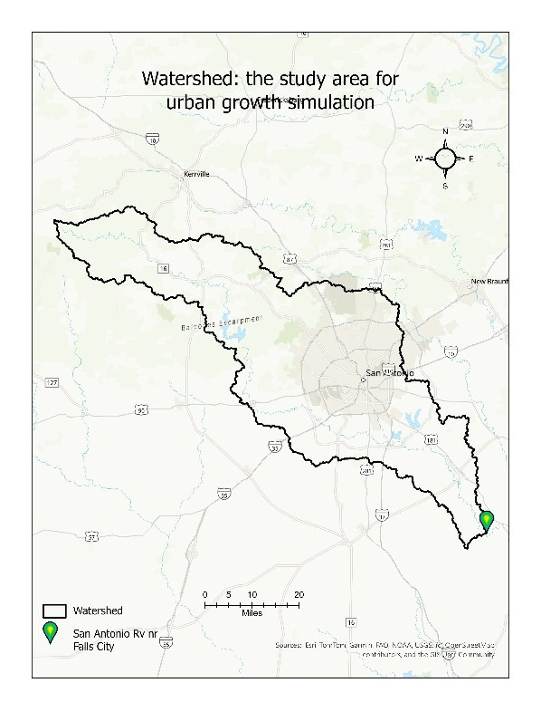
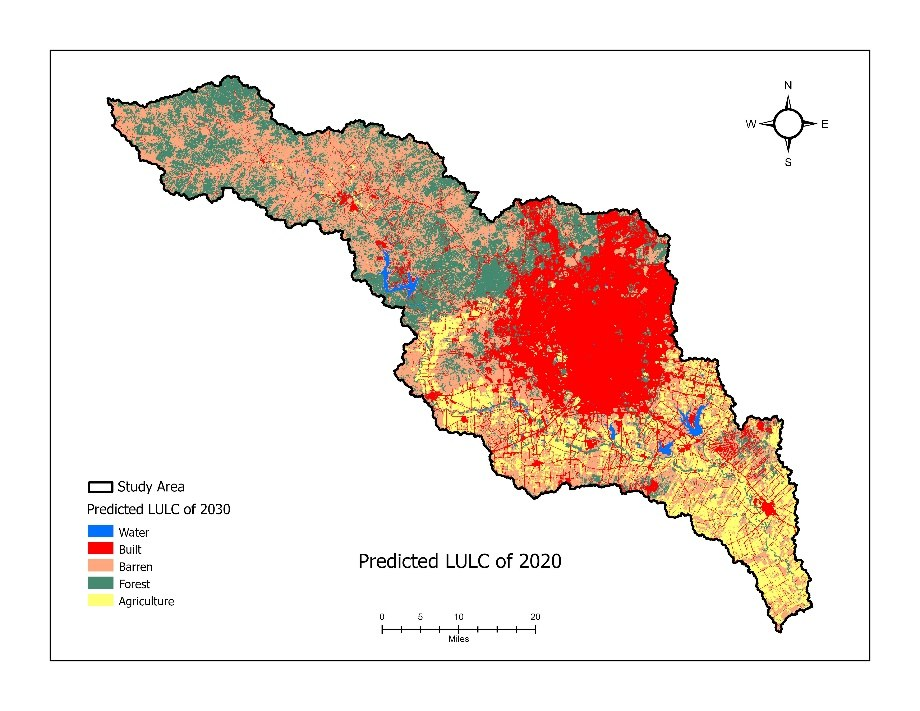
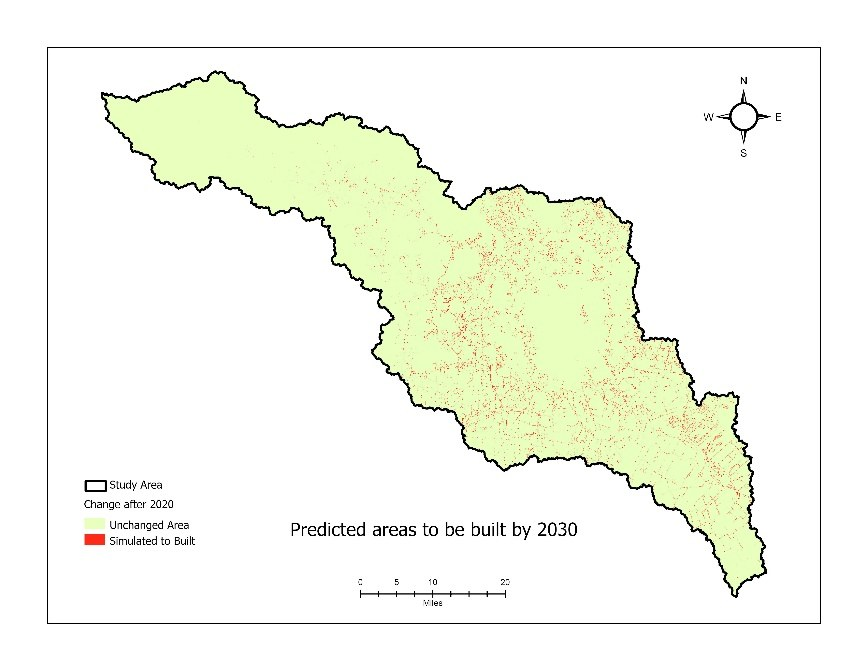
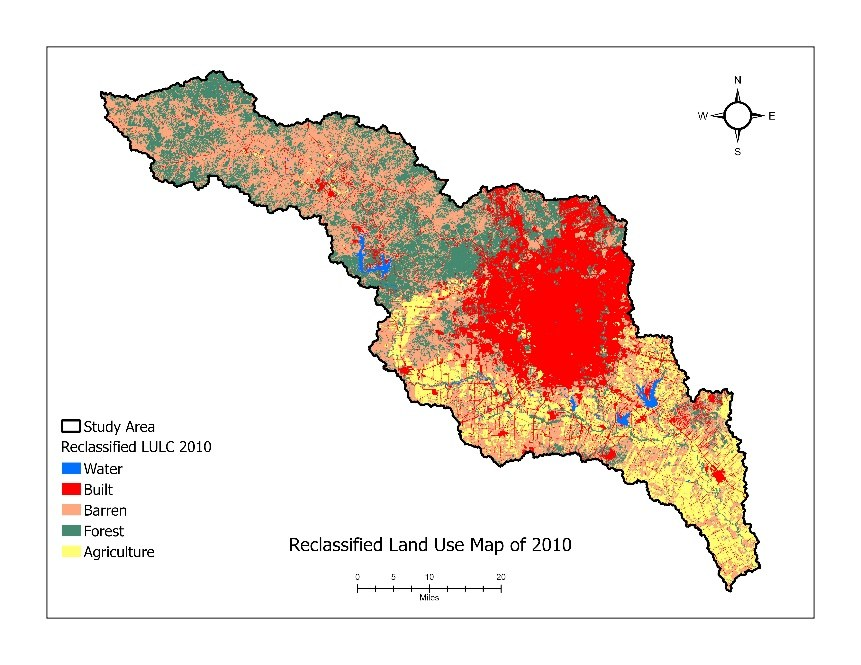
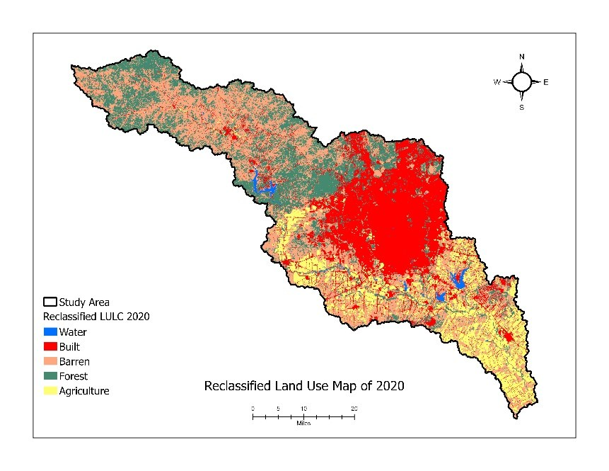

# Where a City Grows: Forecasting Urban Expansion with a Markov-CA Model

**A predictive land-change model that forecasts where San Antonio will urbanize by 2030, validated against observed change at a Figure of Merit of 0.85.**

Urban growth reshapes watershed hydrology. More impervious surface means more runoff, higher flood risk, and less groundwater recharge. Knowing *where* a city will expand lets planners act before the change happens. This project learns how land cover actually changed across the San Antonio River watershed from 2010 to 2020, calibrates a spatial growth model against that change, and projects it forward to 2030.



*Simulated 2030 land cover. New urban growth concentrates near the existing core and along major highways.*

## The headline

- A Markov chain and Cellular Automata (Markov-CA) model, calibrated on observed 2010 to 2020 transitions, reproduces new urban development with a **Figure of Merit of 0.85** (false negatives 7.6%, false positives 6.6%).
- **Neighborhood influence, not road or highway proximity, was the dominant growth driver** (calibrated weight beta4 = 7, against beta = 2 for roads, highways, and facilities). New building happens next to existing building.
- Built land is effectively permanent: the 2010 to 2020 transition matrix shows built cells staying built with probability 0.994.

## Why this is more than a map

Most land-cover products show you what *is*. This shows you what is *likely to become*, and then checks that claim. The model is not just simulated forward; it is calibrated against a held-out observed year (2020) and scored with an explicit accuracy metric before any 2030 projection is trusted. The contribution is the validation discipline, not the forecast image.

## Study area

Watershed of the San Antonio River near Falls City, TX (USGS gauge 08183500), delineated from a 30 m DEM. Roughly 5,453 km square, containing the urban core of San Antonio.



## Data

| Dataset | Year | Source |
|---|---|---|
| DEM (watershed delineation) | static | USGS EarthExplorer |
| NLCD land cover | 2010 and 2020 | MRLC |
| Roads (highways vs. general) | static | TxDOT Open Data |
| Attractive features (universities, markets, facilities) | static | OpenStreetMap |

## Method

1. **Delineate the watershed** from the DEM in ArcGIS Pro (Fill, Flow Direction, Flow Accumulation, Snap Pour Point, Watershed).
2. **Reclassify** NLCD 2010 and 2020 into five classes: Water, Built, Barren, Forest, Agriculture.
3. **Markov chain.** Compute the 2010 to 2020 transition probability matrix in Python (`src/markov_transition_matrix.py`).
4. **Cellular Automata spatial factors.** Normalized Euclidean distance to general roads, major highways, and attractive features, plus neighborhood influence (share of built cells in a 3x3 window).
5. **Transition potential** per cell: `TP = alpha*(Markov prob) + beta1*roads + beta2*highways + beta3*facilities + beta4*neighborhood`.
6. **Transition rule.** A barren, forest, or agriculture cell becomes built when its transition potential exceeds a calibrated threshold.
7. **Calibrate** the weights and threshold by simulating 2020 from a 2010 start and maximizing the Figure of Merit against observed 2020 (`src/calibration_figure_of_merit.py`), then **project 2030**.

| Calibration workflow | Neighborhood influence (top driver) |
|---|---|
|  |  |

### A note on reproducibility and scope

The Markov transition matrix and the Figure of Merit validation are scripted in Python and included here. The Cellular Automata simulation itself (applying the transition-potential equation and threshold across the raster, and projecting 2030) was carried out in ArcGIS Pro using the raster calculator and the calibrated weights reported above. That portion is therefore reproducible from the documented weights and workflow rather than from a single script. Porting the CA step to a standalone Python/`numpy` routine is the natural next iteration.

### How Figure of Merit is defined here

Figure of Merit is computed on **new urban development only**, not across all land-cover categories. Cells already built in 2010 are masked out, and the metric is hits / (hits + misses + false alarms) for the transition to built, following Pontius et al. (2008). This is the appropriate framing when the question is specifically "where does *new* building appear," and it is reported transparently so the number is not confused with an all-category FoM.

## Results

- **Calibrated accuracy:** Figure of Merit 0.85 on new built-up development; false negatives 7.6%, false positives 6.6%.
- **Calibrated weights:** neighborhood influence dominated (beta4 = 7), then Markov probability (alpha = 5), with roads, highways, and facilities each = 2; threshold = 10.5.
- **Transitions 2010 to 2020:** 4% of barren, 3% of agriculture, and 2% of forest converted to built; built areas were over 99% stable.
- **2030 forecast:** continued growth concentrated near the existing core and along major highways.

| Predicted 2020 vs. observed (validation) | New growth forecast by 2030 |
|---|---|
|  |  |


### Transition probability matrix (2010 to 2020)

| From \ To | Water | Built | Barren | Forest | Agri |
|---|---|---|---|---|---|
| Water | 0.880 | 0.005 | 0.083 | 0.012 | 0.019 |
| Built | 0.000 | **0.994** | 0.004 | 0.001 | 0.001 |
| Barren | 0.001 | 0.041 | 0.901 | 0.045 | 0.012 |
| Forest | 0.000 | 0.022 | 0.045 | 0.932 | 0.001 |
| Agriculture | 0.000 | 0.032 | 0.087 | 0.000 | 0.880 |

| Land cover 2010 | Land cover 2020 |
|---|---|
|  |  |

## Limitations and next steps

- Growth drivers are limited to proximity and neighborhood. Demographics, economics, zoning policy, and climate are not yet included.
- The two-date Markov chain assumes stationary transition probabilities, which is a strong assumption over a single decade.
- 30 m resolution and a single watershed limit transferability; the model has not been tested on another basin.
- The CA simulation step is not yet scripted in Python (see the reproducibility note above).
- Outputs identify likely-change locations, not calibrated probabilities of change.

## Run it

```bash
python -m venv .venv && source .venv/bin/activate   # Windows: .venv\Scripts\activate
pip install -r requirements.txt
python src/markov_transition_matrix.py
```

`markov_transition_matrix.py` runs in plain Python and prompts for the two reclassified LULC rasters. `calibration_figure_of_merit.py` requires ArcGIS Pro (`arcpy`) because it reads rasters from a project geodatabase. Raster data is not committed; sources are listed in the Data table above.

## Selected reference

Pontius, R. G., Boersma, W., Castella, J. C., Clarke, K., de Nijs, T., Dietzel, C., Duan, Z., Fotsing, E., Goldstein, N., Kok, K., Koomen, E., Lippitt, C. D., McConnell, W., Mohd Sood, A., Pijanowski, B., Pithadia, S., Sweeney, S., Trung, T. N., Veldkamp, A. T., & Verburg, P. H. (2008). Comparing the input, output, and validation maps for several models of land change. *The Annals of Regional Science, 42*(1), 11-37. https://doi.org/10.1007/s00168-007-0138-2

---

*Author: Nirajan Tripathi, M.S. Geography (GIS and remote sensing), Texas State University.*
[Portfolio](https://nirajan550123.github.io/) · [LinkedIn](https://www.linkedin.com/in/nirajan-tripathi-5434a8308/) · [GitHub](https://github.com/nirajan550123)
